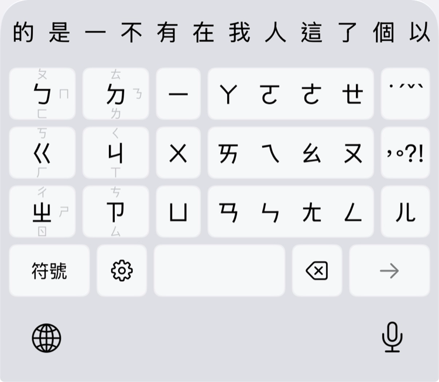
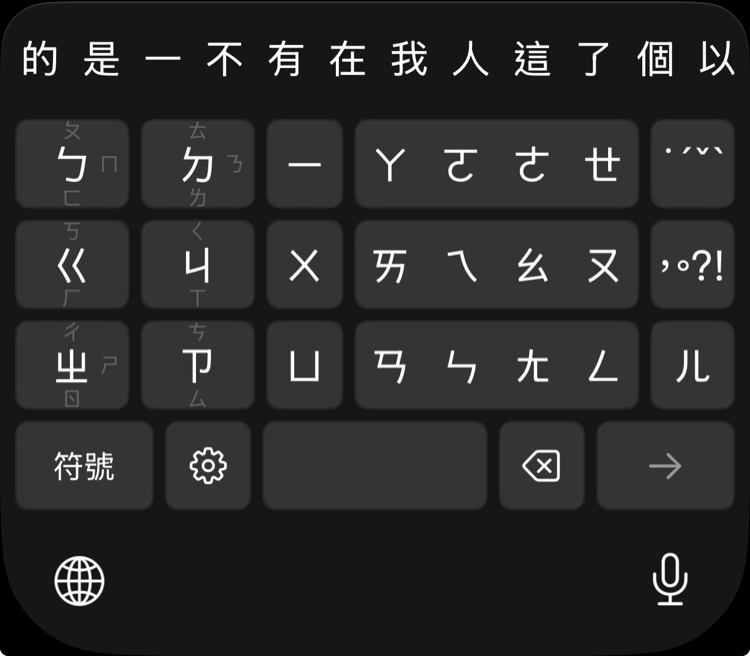

  

<h1 align="center">胖打注音 — Panda Zhuyin</h1>

  
  
  
  

為粗手指設計的滑動注音鍵盤

---

將 37 個注音符號依照注音表的聲韻分類，分配到少數大按鍵上。點擊輸入中心符號，滑動輸入同組其他符號。

  
  

## 特色

- **鍵少、鍵大** — 注音、聲調、標點，用少量大鍵搞定。每個鍵都大到不會按錯隔壁
- **點擊 + 滑動** — 靈感來自日文 flick 鍵盤。點一下是中央符號，往不同方向滑是同組的其他注音
- **三區分明** — 聲母在左、介音在中、韻母在右，位置符合直覺
- **組合韻母，一次完成** — 介音可以直接拖動到韻母滑動條上，一個動作輸入整組韻母
- **智慧灰化導航** — 輸入過程中，不可能的下一步自動變灰，縮小範圍，少走彎路
- **不連網、不收集資料** — 完全離線運作，不存取網路、不收集打字內容

## 下載

現已於 App Store 上架，免費下載（iOS 17 以上）：

<a href="https://apps.apple.com/tw/app/%E8%83%96%E6%89%93%E6%B3%A8%E9%9F%B3/id6761426494">
  <picture>
    <source media="(prefers-color-scheme: dark)" srcset="assets/app-store-badge/badge-white.svg">
    
  </picture>
</a>

## 回饋

- 📋 [填寫使用回饋問卷](https://forms.gle/ZvrZobBTjSf5fCr36)
- 🐛 [回報 bug 或建議](https://github.com/yintzuyuan/panda-zhuyin/issues)

## 連結

- [官網](https://erikyin.net/panda-zhuyin/)
- [Facebook 粉專](https://www.facebook.com/profile.php?id=61573365660777)
- [Demo 影片](https://youtu.be/UTZcWiyojag)
- [隱私權政策](https://erikyin.net/panda-zhuyin/privacy.html)
