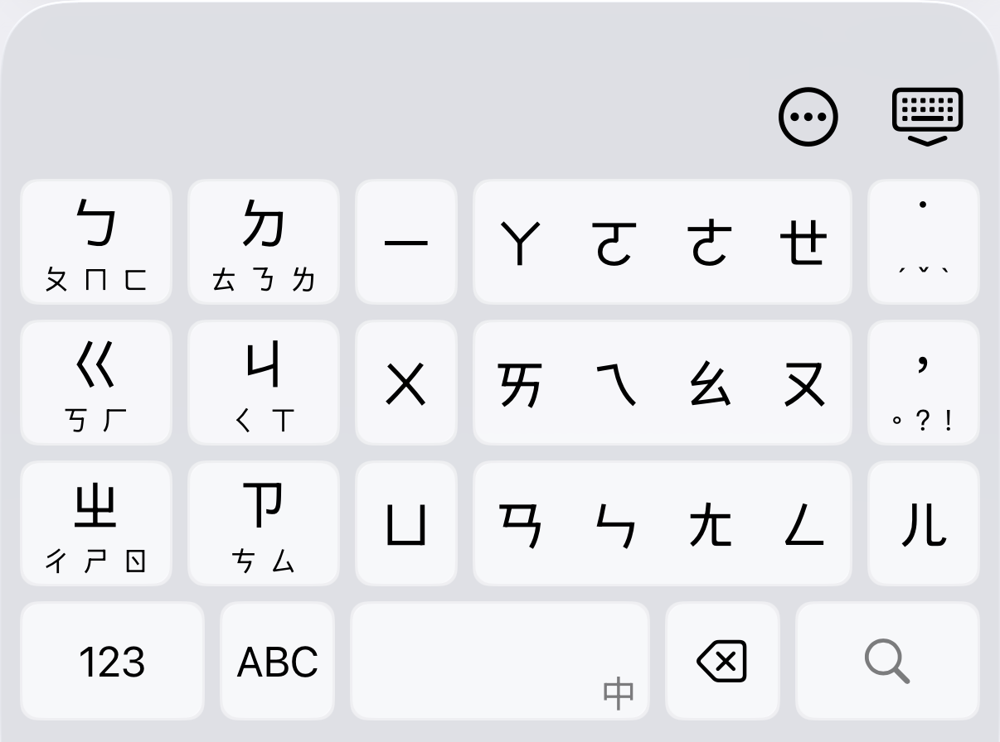
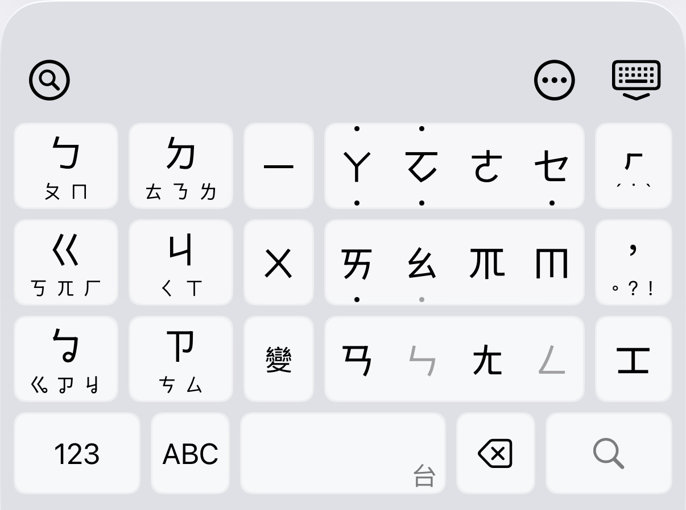

  

<h1 align="center">胖打注音 — Panda Zhuyin</h1>

  
  
  
  

打得穩的注音與台語鍵盤

---

將 37 個注音符號依照注音表的聲韻分類，分配到少數大按鍵上。點擊輸入中心符號，滑動輸入同組其他符號。2.0 起支援台語方音輸入，組字引擎為開源 Homa。

  
  

## 特色

- **鍵少、鍵大** — 注音、聲調、標點，用少量大鍵搞定。每個鍵都大到不會按錯隔壁
- **點擊 + 滑動** — 靈感來自日文 flick 鍵盤。點一下是中央符號，往不同方向滑是同組的其他注音
- **三區分明** — 聲母在左、介音在中、韻母在右，位置符合直覺
- **介音＋韻母，一個動作** — 長按介音鍵展開十字選盤，手指不放開、順勢再滑一格，整組音節一次完成
- **智慧灰化導航** — 輸入過程中，不可能的下一步自動變灰，縮小範圍，少走彎路
- **台語方音鍵盤** — 完整 7 聲調、入聲與鼻化韻；詞庫整合四個公開來源交叉比對（App 設定開啟後，語系鍵右滑切換）
- **羅馬字查詢與邊打邊學** — 方音與臺羅、白話字逐音節對照、反白替換；學習模式按鍵角標配漢語拼音或臺羅、白話字
- **中英混打** — 英文鍵盤標準 QWERTY：下滑輸入大寫、支援歐文變音字母；語系切換鍵點選切中英
- **主題外觀** — 主題編輯器（顏色、圓角、字級字重、邊框、自訂底圖）免費；精選特效主題包、字型切換、液態玻璃色組與背景漸層走 Supporter 訂閱
- **「忘記」功能** — 個別忘記某個學過的字／一鍵重置所有學過的詞，你掌控你的學習資料
- **進階符號輸入** — 半形與全形符號重排：高頻句讀直接上屏、括號開邊主鍵下滑換閉邊；老國音符號從候選符號分頁取用
- **不存取網路、不收集打字內容** — 兩條核心事實獨立成立。Full Access 用途只有兩項：震動回饋、從鍵盤選單開啟 App（Apple 鍵盤 extension 平台限制），開啟與否都不影響上面兩條事實

## 下載

現已於 App Store 上架，免費下載（iOS 18 以上）：

<a href="https://apps.apple.com/tw/app/%E8%83%96%E6%89%93%E6%B3%A8%E9%9F%B3/id6761426494">
  <picture>
    <source media="(prefers-color-scheme: dark)" srcset="assets/app-store-badge/badge-white.svg">
    
  </picture>
</a>

## 支持開發

胖打核心輸入永遠免費。想支持，有兩種方式：

- **App 內訂閱** — 胖打 Supporter（月 NT$30／年 NT$290）：解鎖精選特效主題包（織光、暖霞、青嵐）、字型切換、液態玻璃色組與背景漸層
- **站外打賞** — 純贊助，不解鎖功能、沒有後續扣款：
  - 🇹🇼 [綠界 ECPay](https://erikyin.net/panda-zhuyin/#support)
  - ☕ [Buy Me a Coffee](https://erikyin.net/panda-zhuyin/#support)
  - 💰 [PayPal](https://erikyin.net/panda-zhuyin/#support)

## 回饋

- 📋 [填寫使用回饋問卷](https://forms.gle/ZvrZobBTjSf5fCr36)

## 連結

- [官網](https://erikyin.net/panda-zhuyin/)
- [Facebook 粉專](https://www.facebook.com/profile.php?id=61573365660777)
- [Demo 影片](https://youtu.be/UTZcWiyojag)
- [隱私權政策](https://erikyin.net/panda-zhuyin/privacy.html)
